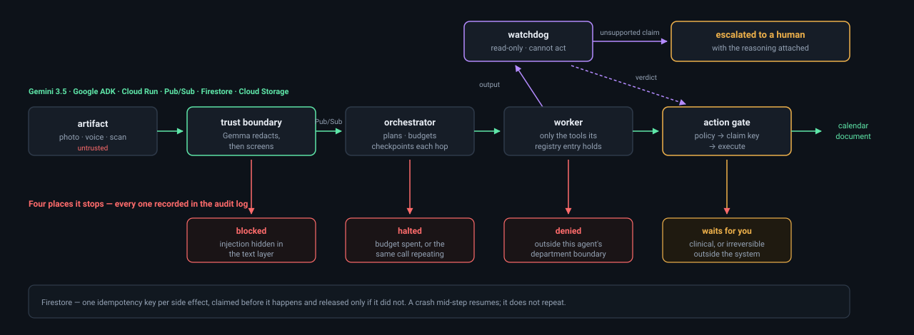
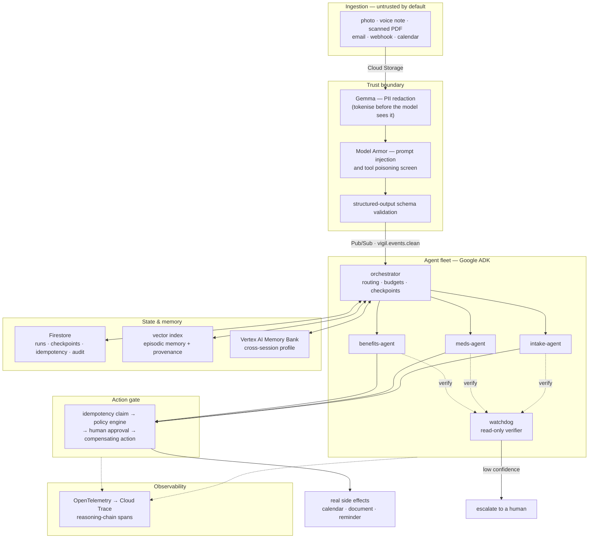

# Vigil

> An agent fleet that keeps watch, so caregivers don't have to.

**Category:** The Fortified Enterprise Fleet
**Status:** 🚧 in development — All Things Agentic Hackathon, submission due Aug 31, 2026

> ⚠️ **All data in this repository and in the demo is synthetic.** Vigil is an
> administrative coordination assistant. It does not provide medical advice,
> diagnosis, or treatment decisions, and every clinical action requires human
> approval.

---

## 1. The friction

Someone caring for an ageing parent at home is running an operations job nobody
trained them for. Appointments at three different providers. Eight medications
with overlapping schedules and interaction warnings. Insurance and benefits
paperwork with hard deadlines buried in the middle of dense letters. Lab results
that arrive as a crooked phone photo of a printed page. Notes recorded as a
voice memo in a hospital corridor.

It runs for months, the inputs are unstructured and messy, and getting it wrong
has real consequences.

## 2. What Vigil does

- Turns messy multimodal intake — photos of pill bottles, scanned PDFs, voice
  notes — into structured, provenance-tagged events.
- Runs **for weeks in the background**, not as a chat session, and remembers what
  was decided in week 1 when it acts in week 3.
- **Decides** what happens next and delegates to the right specialist agent
  rather than following a fixed script.
- **Stops and asks a human** before anything risky, and escalates with its
  reasoning attached when its own confidence is low.
- **Never performs the same side effect twice**, even when a worker is killed
  mid-flight and the run resumes on another instance.
- Records every decision as an auditable reasoning trace.

## 3. Why this is a *fleet*, not an agent

A care network is a real distributed organisation with four departments and
strict data boundaries between them. Vigil models it as such, and enforces the
boundaries with per-agent identity rather than with prompt instructions.

| Department | Agent | May read | May **not** read |
|---|---|---|---|
| Family | `intake-agent` | everything except raw clinical notes | full insurance identifiers |
| Clinical | `meds-agent` | clinical data | financial data |
| Benefits | `benefits-agent` | administrative metadata, invoices | **clinical notes** |
| Audit | `watchdog` | all traces and audit logs | de-tokenised PII values |

`orchestrator` routes between them and owns budgets, checkpoints and idempotency
keys. It holds no business tools of its own.

## 4. Architecture



The diagram above is the claim in one picture: an artifact arrives untrusted, and
between arriving and changing anything in the world it passes four places where
it can be stopped — and every stop is recorded. The flowchart below shows the
same system by component.



### Reliability mechanisms

| Mechanism | What it prevents | Where |
|---|---|---|
| Checkpoint **before** side effect, complete **after** | duplicate work after a crash | [`state.py`](src/vigil/state.py) |
| Idempotency claim as an atomic Firestore create | the resumed run that files the same claim twice | [`state.py`](src/vigil/state.py) |
| Dead-letter topic after 5 delivery attempts | infinite retry loops burning credits | [`bus.py`](src/vigil/bus.py) |
| Step / tool-call / token budgets | runaway breadth | [`budget.py`](src/vigil/fleet/budget.py) |
| Repeat detector on identical tool calls | a stuck loop, minutes before the budget notices | [`toolbelt.py`](src/vigil/fleet/toolbelt.py) |
| Eval gate + anti-gaming judge | a self-improvement that scored higher by memorising the tests | [`evolution.py`](src/vigil/fleet/evolution.py) |
| Read-only watchdog agent | hallucinated facts reaching a side effect | [`pipeline.py`](src/vigil/fleet/pipeline.py) |
| Append-only audit log | undetectable after-the-fact edits | [`state.py`](src/vigil/state.py) |

## 5. Mandatory stack compliance

| Requirement | How Vigil meets it | Where |
|---|---|---|
| Gemini 3.5 or newer via Gemini API / Vertex AI | planning, multimodal extraction, conflict resolution | `VIGIL_MODEL_FAST` / `VIGIL_MODEL_DEEP` in [`config.py`](src/vigil/config.py) |
| A Google agent framework | **Google ADK** (`google-adk`) for the orchestrator and workers | [`pyproject.toml`](pyproject.toml) |
| A Google Cloud infrastructure service | **Cloud Run**, **Pub/Sub**, **Firestore**, **Cloud Storage**, Secret Manager, Cloud Trace | [`deploy.sh`](deploy.sh) |
| Additional Google AI models | **Gemma** redacts names, addresses and dates of birth before anything reaches the reasoning tier; **Veo** renders the weekly digest as a shareable clip; **Lyria** generates three urgency signatures so a notification can be told apart without looking | [`redaction.py`](src/vigil/redaction.py), [`digest.py`](src/vigil/digest.py) |

None of the three are decoration. Gemma does the pass a regex cannot — a person's
name is the identifier that matters most in a care record and the one no pattern
finds. Lyria's cues answer the only question a notification has to answer when
someone's hands are full: *do I need to stop what I am doing?* A badge cannot
answer that; three distinguishable sounds can.

They are served by the Gemini API rather than Vertex, so they carry a second
credential — see [ADR 011](docs/adr/011-two-model-backends.md).

## 6. Spin-up instructions

### Option A — fully local, no Google Cloud account required

Everything runs against emulators. Useful for reviewing the system without
creating a billing account.

```bash
make install     # uv sync + create .env from .env.example
make up          # Firestore, Pub/Sub, Cloud Storage and Jaeger in Docker
make seed        # create topics, subscription and bucket

make api         # terminal 1 — http://localhost:8000/docs
make worker      # terminal 2 — background execution
make smoke       # terminal 3 — push one event through the whole pipeline
```

Then open the reasoning trace at <http://localhost:16686>.

Emulator limitations, stated honestly: the Firestore emulator does not support
vector search, and Model Armor and Memory Bank have no local emulator. Those
three paths fall back to in-repo local implementations and take the managed path
once deployed.

### Option B — deploy to Google Cloud

```bash
gcloud auth login
gcloud config set project YOUR_PROJECT_ID    # billing must be enabled
./deploy.sh                                   # idempotent, safe to re-run
```

`deploy.sh` enables the APIs, creates Firestore and the Pub/Sub topics, creates
one service account per role with least-privilege bindings, deploys Cloud Run
with `min-instances=0` and `max-instances=3`, and wires a push subscription
authenticated with OIDC. It prints the service URL, an API key, and the console
links to capture as deployment evidence.

When filming is finished: `./scripts/teardown.sh`.

## 7. Cost control

Three independent layers stop a runaway agent from draining a budget:

1. **In code** — `VIGIL_MAX_STEPS`, `VIGIL_MAX_TOOL_CALLS`, `VIGIL_MAX_TOKENS_PER_RUN`.
   Exceeding any of them aborts the run and writes an audit entry.
2. **In infrastructure** — `--max-instances=3`, and a dead-letter policy after
   five delivery attempts.
3. **In billing** — budget alerts on the project.

Push subscriptions rather than a polling worker mean nothing stays warm; the
service sleeps at zero instances between events.

## 8. Data handling and its limits

Health data, so the honest version matters more than the reassuring one.
[`docs/compliance.md`](docs/compliance.md) covers what is collected, how
identifiers are removed and where that removal stops working, where data lives,
and what waits for a human. Three things worth knowing before reading it:

- **All data is synthetic.** Nothing here depicts a real person or record.
- **Model calls are served from Vertex's `global` location, not `us-central1`.**
  Regional endpoints serve only up to Gemini 2.5 and the mandatory tier is 3.5 or
  newer, so a request may be served from any region. For real health data that is
  a decision for whoever owns it; it is stated rather than buried.
- **Without the Gemma credential, names and addresses are not redacted.** The
  system says so in the log rather than degrading quietly.

## 9. Repository layout

```
src/vigil/
  config.py      settings; the only thing that differs local vs cloud
  telemetry.py   OpenTelemetry spans + structured logging
  bus.py         Pub/Sub topics, subscriptions, dead-letter policy
  state.py       runs, checkpoints, idempotency claims, audit log
  api.py         ingress + Pub/Sub push endpoint
  worker.py      pull worker (local) — shares handle_event with the push path
scripts/         bootstrap, smoke test, chaos test, teardown
docs/adr/        architecture decision records
```

## 10. Findings and learnings

**A multi-agent fleet does not fit in a free tier, and the reason is structural.**
The Gemini API free tier allows 20 requests per day per model. One
orchestrator → worker → watchdog chain costs six to ten: each hop spends a call
to plan, another to read a tool result, another to answer. That is two runs a
day. The limit is not a pricing inconvenience to work around — it is a signal
that fan-out architectures are priced per hop, and the count is easy to
under-estimate when you are thinking in agents rather than in requests.

**On Vertex AI, Gemini 3.x is served from `global` and nowhere else.** Regional
endpoints — `us-central1`, `us-east5` — return 404 for every 3.x model while
happily serving 2.5. The failure mode is not the 404; it is the obvious fix.
Faced with a model that "does not exist" in their region, the natural move is to
drop to the 2.5 that works, which silently breaks the requirement to use Gemini
3.5 or newer. The Vertex *location* is also not the region the infrastructure
lives in: Cloud Run and Firestore stay in `us-central1` while model calls go to
`global`, so they are separate settings rather than one.

**Retrying a 429 can consume the quota you are waiting for.** Both the
per-minute and the per-day limit arrive as the same status code, and transport
retry cannot tell them apart. Backing off six times against a per-minute limit
is correct; doing it against a per-day limit spends six more of an allowance
that is already gone. Only the `quotaId` distinguishes them, so
`fleet/run.py:_is_daily_quota` reads it and stops instead of retrying.

**The retry has to sit at the transport layer.** ADK's `LlmAgent.retry_config`
retries *workflow nodes*; a 429 raised inside the LLM flow propagates straight
past it. `HttpRetryOptions` on the `Gemini` model retries the HTTP call, which
is where the status code actually is. Passing a model id as a bare string gets a
default client with no retry at all.

**Confidence has to be calibrated or it does not exist.** The first version of
the intake instruction asked for a confidence on every claim and got 1.00 on all
of them. The policy engine gates on low confidence, so a uniformly maximal score
silently disabled a safety rule. Giving the model a four-band reference — what
0.95 means versus 0.5 — produced 0.98 for printed text, 0.50 for smudged
handwriting and 0.40 for a hedged voice note in the same document.

**A call-count ceiling is the wrong shape for a stuck agent.** The orchestrator
got into a loop calling the same discovery tool with identical arguments. The
40-call budget would have stopped it — after thirteen minutes and forty model
round-trips. Bounded in theory, a hang in practice, and expensive the whole way.
Runaway *breadth* and a stuck *loop* are different failures: the first needs a
ceiling, the second needs to notice that identical arguments cannot produce a new
answer. The guard now refuses the third identical call and tells the model, in
those words, that it is circling.

**A run longer than the ack deadline is redelivered mid-flight.** Pub/Sub's
60-second default is far shorter than three agent hops, so every run was
delivered twice while the first was still working. The idempotency claims held —
nothing ran twice — but the second delivery then wrote a terminal status onto a
run that was still in progress, marking a live run finished. Exactly-once on the
side effects is not the same as exactly-once on the *bookkeeping*: only the
delivery that owns the run may close it.

**Isolating an instruction means neutralising the parts of it that assume a
runtime.** The golden set scored the `meds-agent` instruction at 0.08 and the
number was meaningless. The instruction tells the agent to read the medication
graph before proposing anything, so with no tools attached in the eval harness
the model emitted a function call and no text — twelve cases failing for a reason
that had nothing to do with the quality of the instruction. A short preamble
stating that no tools exist and the data is in the question took the baseline to
0.50–0.75, where the remaining failures were real ones.

**A gamed proposal that raises the score is the only interesting test of an
eval gate.** The obvious gaming — "when in doubt, escalate" — makes the agent
decline everything and the score falls, so any gate catches it. The version that
matters added no hedging at all: it hardcoded answers for the specific cases in
the suite. The score rose from 0.67 to 0.92 and the refusal rate on answerable
cases *improved*. Every number said promote. It was rejected because the judge
is given the instruction diff as well as the scores, and the diff named
`Metaform`, `Cardiolex`, `Ferrog?n` — memorisation, not capability. A gate that
sees only the score has no way to tell those apart.

**An empty environment variable is not an unset one.** `FIRESTORE_EMULATOR_HOST=`
is the obvious way to bypass an emulator for a single command, and to the Google
SDKs it is a hostname — every call then fails with `the target uri is not valid:
dns:///`. Silently, in our case: the version record from a three-minute
evaluation was never persisted, and only the best-effort logging showed it.
`config.py` now deletes empty `*_EMULATOR_HOST` variables so the obvious thing
works.

**Tests earn their place on integration seams, not on logic.** Three real
defects came from tests written against behaviour rather than implementation: an
email regex that swallowed the trailing full stop and so corrupted the
de-tokenisation map; an `audit()` call whose keyword collided with its own first
parameter and would have raised on every gated action; and an emulator guard
that checked an environment variable instead of a socket, so the suite hung for
199 seconds against a stopped container instead of skipping in one.

## 11. Pre-existing work disclosure

All code in this repository was written during the submission period
(Aug 3–31, 2026). No pre-existing work was incorporated. AI coding assistants
were used during development, as permitted by the rules.

## License

MIT
